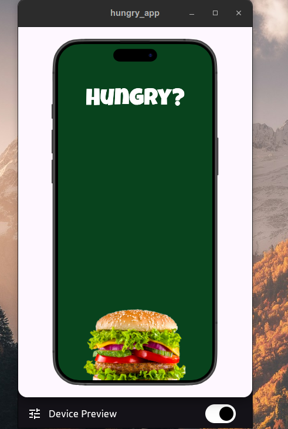
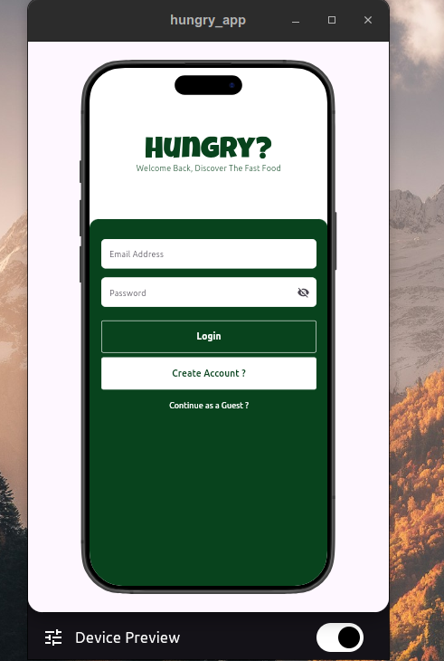
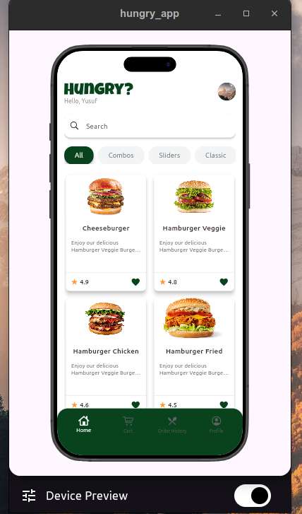
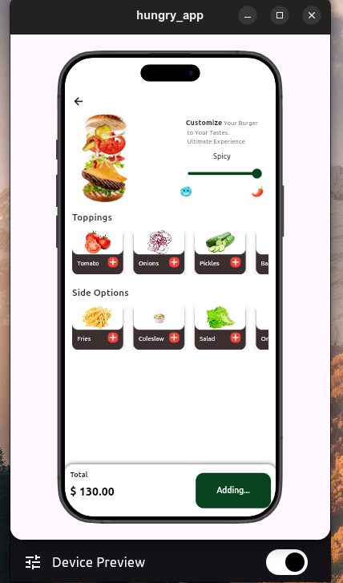
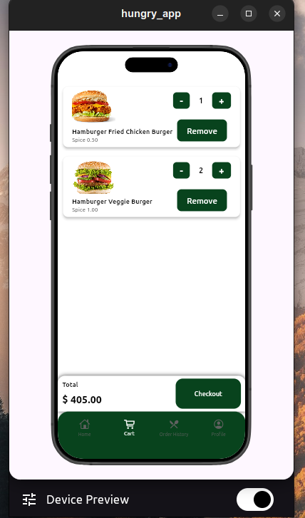
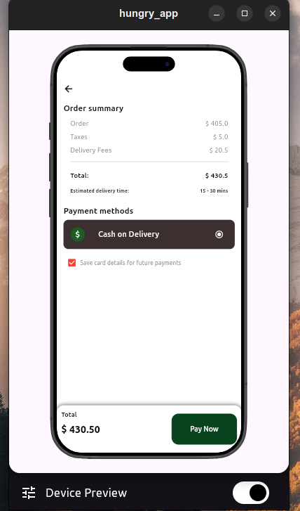
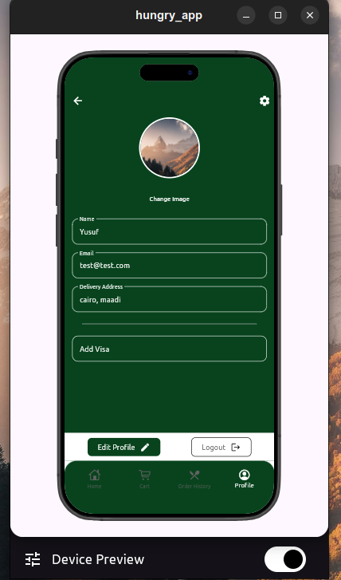
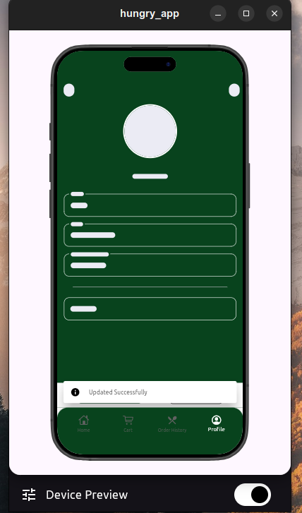
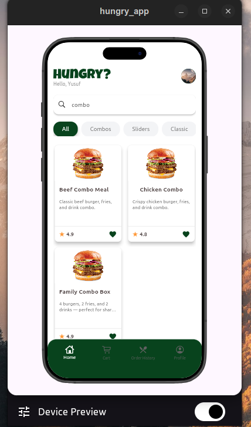

# 🍔 Hungry App - Fast Food Delivery Application

A modern, feature-rich Flutter application for fast food ordering and delivery, built with clean architecture and state management using BLoC/Cubit.

## 📱 Screenshots

### Authentication Flow
<div style="display: flex; gap: 10px;">
  
  

</div>

### Home & Product Details
<div style="display: flex; gap: 10px;">
  
  
</div>

### Cart & Checkout
<div style="display: flex; gap: 10px;">
  
  
</div>

### Profile
<div style="display: flex; gap: 10px;">
  
  
</div>

## ✨ Features

### 🔐 Authentication & User Management
- **User Registration** - Create new account with email and password
- **Login System** - Secure authentication with token management
- **Guest Mode** - Browse and explore without registration
- **Auto Login** - Persistent sessions using SharedPreferences
- **Profile Management** - View and edit user information
- **Image Upload** - Custom profile picture support

### 🍕 Food Ordering
- **Browse Menu** - View all available food items with images and ratings
- **Category Filter** - Filter by Combos, Sliders, Classic, etc.
<div style="display: flex; gap: 10px;">
  

</div>
- **Search Functionality** - Find specific items quickly
- **Product Details** - Customize orders with toppings and side options
- **Spice Level Control** - Adjust spiciness with interactive slider
- **Dynamic Pricing** - Real-time price calculation

### 🛒 Shopping Cart
- **Add to Cart** - Add customized items to cart
- **Quantity Management** - Increment/decrement item quantities
- **Remove Items** - Delete unwanted items from cart
- **Real-time Updates** - Instant cart total calculation
- **Persistent Cart** - Cart data persists across sessions

### 💳 Checkout & Payment
- **Order Summary** - Clear breakdown of order, taxes, and delivery fees
- **Payment Methods** - Cash on Delivery and Debit Card options
- **Save Card Details** - Option to save payment information
- **Order Confirmation** - Success dialog with order details
- **Estimated Delivery Time** - Show expected delivery window

### 👤 Profile Features
- **View Profile** - Display user information and statistics
- **Edit Profile** - Update name, email, address, and payment info
- **Profile Picture** - Upload and change profile image
- **Visa Card Management** - Add and display masked card numbers
- **Logout** - Secure session termination

## 🏗️ Architecture

### Clean Architecture Layers
```
lib/
├── core/
│   ├── constants/          # App-wide constants (colors, strings)
│   ├── di/                 # Dependency injection setup (GetIt)
│   ├── network/            # Network layer (Dio, API services)
│   └── route/              # Navigation and routing
│
├── features/
│   ├── auth/
│   │   ├── login/
│   │   │   ├── data/       # Login repository and models
│   │   │   ├── logic/      # Login BLoC/Cubit
│   │   │   └── views/      # Login UI
│   │   ├── register/       # Registration feature
│   │   ├── profile/        # Profile management
│   │   └── logout/         # Logout functionality
│   │
│   ├── home/
│   │   ├── data/           # Food data models and repository
│   │   ├── logic/          # Home BLoC/Cubit
│   │   └── views/          # Home UI
│   │
│   ├── product/            # Product details feature
│   ├── cart/               # Shopping cart feature
│   ├── checkout/           # Checkout and payment
│   └── orderHistory/       # Order history feature
│
└── shared/                 # Shared widgets and utilities
```

### State Management
- **BLoC/Cubit Pattern** - Predictable state management
- **Freezed** - Immutable state classes
- **GetIt** - Service locator for dependency injection

### Network Layer
- **Dio** - HTTP client for API requests
- **Retrofit** - Type-safe REST client
- **Token Management** - Automatic JWT token injection
- **Error Handling** - Comprehensive error handling with custom exceptions

## 🔧 Technical Stack

### Core Dependencies
```yaml
# State Management
flutter_bloc: ^8.1.6
freezed: ^2.5.7
freezed_annotation: ^2.4.4

# Networking
dio: ^5.7.0
retrofit: ^4.4.1
pretty_dio_logger: ^1.4.0

# Dependency Injection
get_it: ^8.0.0

# Local Storage
shared_preferences: ^2.3.2

# UI Components
flutter_screenutil: ^5.9.3
cached_network_image: ^3.4.1
skeletonizer: ^1.4.2
gap: ^3.0.1

# Code Generation
json_annotation: ^4.9.0
build_runner: ^2.4.12
```

## 📡 API Integration

### Base URL
```dart
static const String baseUrl = "https://sonic-zdi0.onrender.com/api";
```

### Main Endpoints
- **Authentication**
  - `POST /register` - User registration
  - `POST /login` - User login
  - `POST /logout` - User logout
  - `GET /profile` - Get user profile
  - `POST /update-profile` - Update profile

- **Products**
  - `GET /products` - Get all products
  - `GET /toppings` - Get available toppings
  - `GET /side-options` - Get side options

- **Cart**
  - `POST /cart/add` - Add item to cart
  - `GET /cart` - Get cart items
  - `DELETE /cart/remove/{id}` - Remove cart item

- **Orders**
  - `POST /orders` - Place new order
  - `GET /orders` - Get order history

## 🚀 Getting Started

### Prerequisites
- Flutter SDK (>=3.0.0)
- Dart SDK (>=3.0.0)
- Android Studio / VS Code
- An emulator or physical device

### Installation

1. **Clone the repository**
```bash
git clone https://github.com/yourusername/hungry_app.git
cd hungry_app
```

2. **Install dependencies**
```bash
flutter pub get
```

3. **Generate code**
```bash
flutter pub run build_runner build --delete-conflicting-outputs
```

4. **Run the app**
```bash
flutter run
```

## 🎨 Design Patterns

### Repository Pattern
Each feature has its own repository handling data operations:
```dart
class FoodRepo {
  final ApiServices apiServices;

  Future<ApiResult<FoodDataModel>> getFoods() async {
    try {
      final response = await apiServices.getFood();
      return ApiResult.success(response);
    } catch (e) {
      return ApiResult.failure(e.toString());
    }
  }
}
```

### BLoC/Cubit Pattern
State management using cubits:
```dart
class FoodCubit extends Cubit<FoodState> {
  final FoodRepo foodRepo;

  Future<void> getFood() async {
    emit(const FoodState.loading());
    final response = await foodRepo.getFoods();
    response.when(
      success: (data) => emit(FoodState.success(data)),
      failure: (error) => emit(FoodState.failure(error)),
    );
  }
}
```

### Dependency Injection
Using GetIt for service locator:
```dart
final getIt = GetIt.instance;

Future<void> setUpGetIt() async {
  // Network
  getIt.registerLazySingleton<ApiServices>(() => ApiServices(dio));

  // Repositories
  getIt.registerLazySingleton<FoodRepo>(() => FoodRepo(apiServices: getIt()));

  // Cubits
  getIt.registerFactory<FoodCubit>(() => FoodCubit(getIt()));
}
```

## 📱 App Flow

### User Journey
1. **Launch** → Splash Screen with animations
2. **Authentication** → Login/Register or continue as Guest
3. **Home** → Browse food items by category
4. **Product Details** → Customize order (toppings, sides, spice level)
5. **Cart** → Review and modify cart items
6. **Checkout** → Select payment method and confirm order
7. **Profile** → View/edit profile and order history

### Guest Mode Features
- Browse all products
- Search and filter
- View product details
- Limited cart functionality
- Prompted to login for checkout

## 🔒 Security Features

### Token Management
- Secure token storage using SharedPreferences
- Automatic token injection in API requests
- Token refresh mechanism
- Secure logout with token removal

### Data Validation
- Form validation on all input fields
- Email format validation
- Password strength requirements
- Server-side validation

## 🎯 Future Enhancements

- [ ] Order tracking in real-time
- [ ] Push notifications for order updates
- [ ] Favorite items functionality
- [ ] Promo codes and discounts
- [ ] Multiple delivery addresses
- [ ] Rating and review system
- [ ] Order scheduling
- [ ] Dark mode support
- [ ] Multi-language support
- [ ] Social media authentication

## 🐛 Known Issues

- None currently reported

## 📄 License

This project is licensed under the MIT License - see the [LICENSE](LICENSE) file for details.

## 👥 Contributors

- **Your Name** - Initial work - [YourGitHub](https://github.com/yourusername)

## 🙏 Acknowledgments

- Design inspiration from modern food delivery apps
- Icons from [Lucide Icons](https://lucide.dev/)
- Images from [Unsplash](https://unsplash.com/)

## 📞 Contact

For questions or feedback, please reach out:
- Email: your.email@example.com
- GitHub: [@yourusername](https://github.com/yourusername)

---

Made with ❤️ using Flutter
